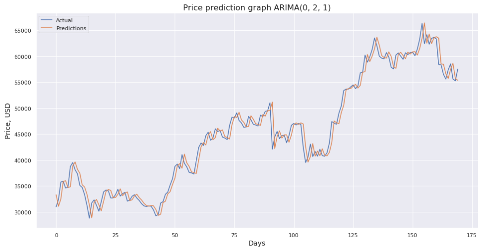
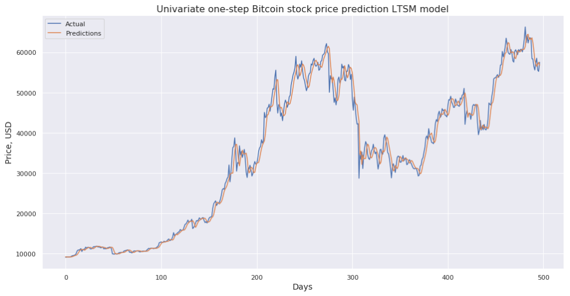
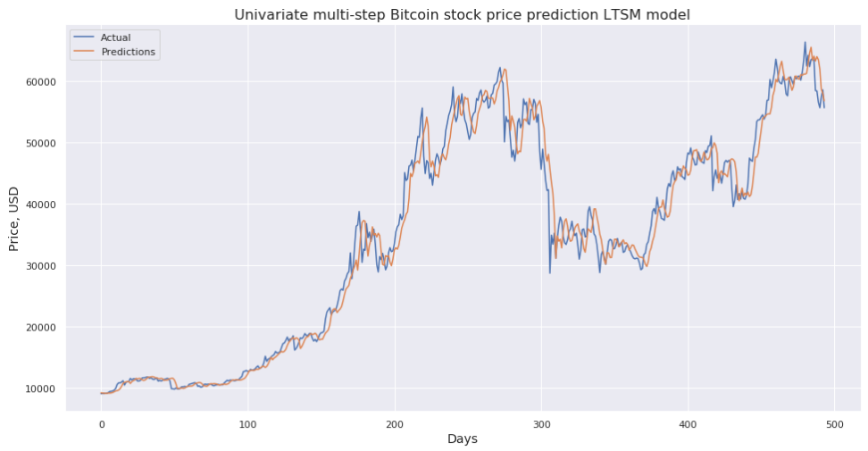

# Machine Learning as a method of Bitcoin price prediction

In 2008 Wall Street started the global financial crisis, which devalued currency not only in US, but around the world. 
After the crisis began, Satoshi Nakamoto introduced Bitcoin as an alternative to the traditional banking infrastructure. 
I was interested in bitcoin waaay after it was cool, but before I was interested ML.

## Contents
  * data/ - downloaded time series folder
  * processed_data/ - folder with processed time series
  * notebook.ipynb - main file with described steps  
  * ETL.ipynb - Explore Transform Load
  * ARMA.ipynb - Autoregressive Moving Average model
  * ARIMA_GS.ipynb - AutoRegressive Integrated Moving Average model parameters Grid Search
  * ARIMA.ipynb - AutoRegressive Integrated Moving Average model
  * LSTM.ipynb - Long Short-Term Memory NN model
  * libraries.py - helper file with necessary libraries and functions

## Visualizations

## Conclusions

This study analyzed the predictability of bitcoin price. None of 4 models proved to be particularly useful in forecasting the price of bitcoin stock. It is clearly seen that predicted price repeats actual price with a lag of 1 day, thus should not be used. 
One of the problems in the bitcoin price forecast remains to be the economists' difficulties in assessing bitcoin fundamental value; thus, inability to predict its stock price. 
Predicting the price of bitcoin is highly problematic - it seems to be more sensitive to the factors other than its own price in the past (e. g. Twitter).

## Next steps

Analysis can be performed on shorter period time series(e.g. 1 hour, 15 minutes).
Multivariate LSTM model can be used (e.g. using not only candlestick OHLC price data, but volume and number of trades). 

Forecasting bitcoin price using its past price and information from Twitter. 

Include sentiment analysis from Twitter as a predictor. (Maybe assign higher weight to tweets from more influential people). 

I have taken the first steps in this process and began gathering tweets. 
Unfortunately, there are >50,000 tweets which mention 'bitcoin' word in one day and a few hours of scrapping tweets I got 'non-200 status code' error.So I'm not able to gather amount of information required for a useful span of time for the model to learn.

